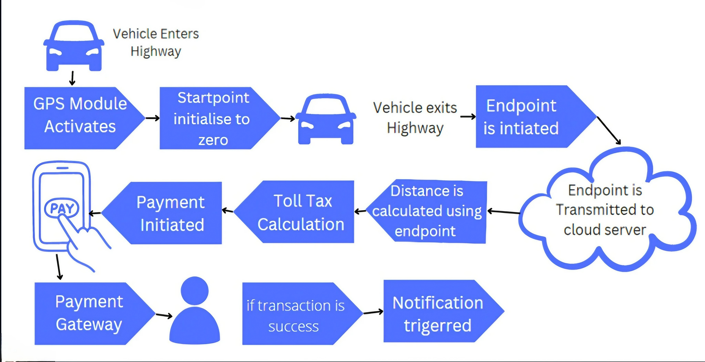
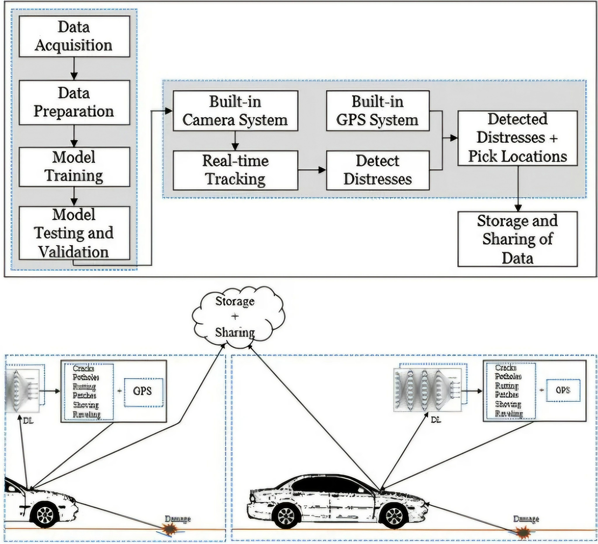

# GPS Simulation Process

**This project simulates a GPS system with distress detection**.

 { display: block; margin-left: auto; margin-right: auto; }

This flowchart depicts the process of a GPS-based toll collection system, considering bypasses and fraud prevention:

⦿ **Vehicle Enters Highway**: The vehicle enters a highway equipped with GPS toll technology.
 
⦿ ***GPS Module Activates**: The vehicle's GPS module automatically activates upon entering the highway.
 
⦿ **Start Point Initialization**: The system initializes the starting point (startPoint) to zero, marking the beginning of the toll journey.
 
⦿ **Alternative (Bypass)**: If the vehicle takes a bypass route (not detected by GPS), the system skips steps 3-10 and proceeds to step 11 (End - Toll Not Applicable).
 
⦿ **Vehicle Exits Highway**: The vehicle exits the highway, triggering the system to record the exit point.
 
⦿ **End Point Initialization**: The system initializes the end point (endPoint) using the recorded exit location.
 
⦿ **End Point Transmission**: The end point (endPoint) is securely transmitted to a cloud server.
 
⦿ **Distance Calculation**: The system calculates the distance traveled (distance) using the start point (startPoint) and end point (endPoint).
 
⦿ **Toll Tax Calculation**: Based on the calculated distance (distance) and pre-defined toll rates, the system determines the toll tax amount (tollTax).
 

⦿ **Payment Initiation**: The system initiates the payment process for the calculated toll tax (tollTax).
 
⦿ **Payment Processing**: Processes according to server programming or connected to any cloud server like AWS which is set though jenkins.\
 
⦿ **Transfer to Payment Gateway**: The payment is securely transferred to a payment gateway for processing.
 
⦿ **Transaction Success**: Upon successful payment completion, a notification is triggered:
 
⦿ **In-App Notification**: The user receives a notification through the app installed on their smartphone.
 
⦿ **Bank Message**: A message is sent directly from the bank to the user's registered mobile number, confirming the transaction.
 
⦿ **E-Receipt Delivery**: An electronic receipt is sent to the user's email address via the e-governance system app, promoting transparency.
 

### Digital Signature Verification:
⦿ **User Verification**: The system obtains a digital signature from the user to verify their identity. This step is crucial to prevent unauthorized transactions.
 
⦿ **Cloud Server Update**: Finally, the transaction details and user verification are securely stored in the cloud server, providing an audit trail.
 
⦿ **End (Toll Not Applicable)**: If the system detects a bypass or the vehicle has already been charged for the same toll booth (within a reasonable time frame), the flowchart ends here, indicating no toll is applicable for this journey.
 
⦿ **Camera Surveillance**: Throughout the process, the system operates under camera surveillance to monitor for bypasses and potential fraudulent activities.

## Key Points:

⦿ This system offers an efficient and transparent method for collecting tolls using GPS technology.
 
⦿ Bypass detection and multiple verification steps (digital signature, camera surveillance) aim to prevent fraud.
 
⦿ In-app notifications, bank messages, and e-receipts provide users with clear and convenient transaction details.

**Note**: A flowchart structure is added as an optional visual aid.

 { display: block; margin-left: auto; margin-right: auto; }

## Key Stages:

**Data Acquisition**:
👉 Gather GPS data (real or synthetic).

**Data Preparation**:
👉 Clean and pre-process the data for model training.

**Model Training**:
👉 Train a machine learning model to identify distress signals.

**Model Testing**:
👉 Evaluate the model's performance using unseen test data.

**Integration**:
👉 Integrate a camera system (optional) and a virtual GPS device.

**Real-Time Tracking**:
👉 Display simulated GPS coordinates and camera feed (if applicable) in real-time.

**Distress Detection**:
👉 Use the trained model to detect distress signals in real-time.

**Distress Response**:
👉 Trigger actions upon distress detection (alerts, notifications).

**Pick Location Identification**:
👉 Identify potential rescue locations based on distress signals and GPS data.

**Data Storage/Sharing**:
👉 Implement mechanisms to store and potentially share collected data.

