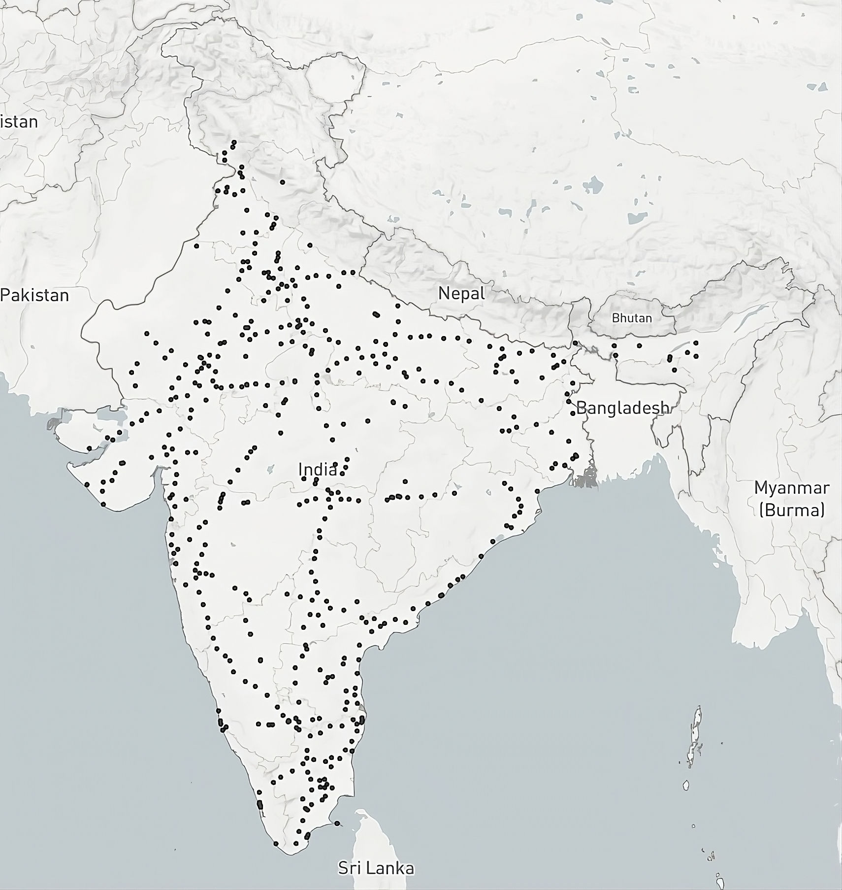
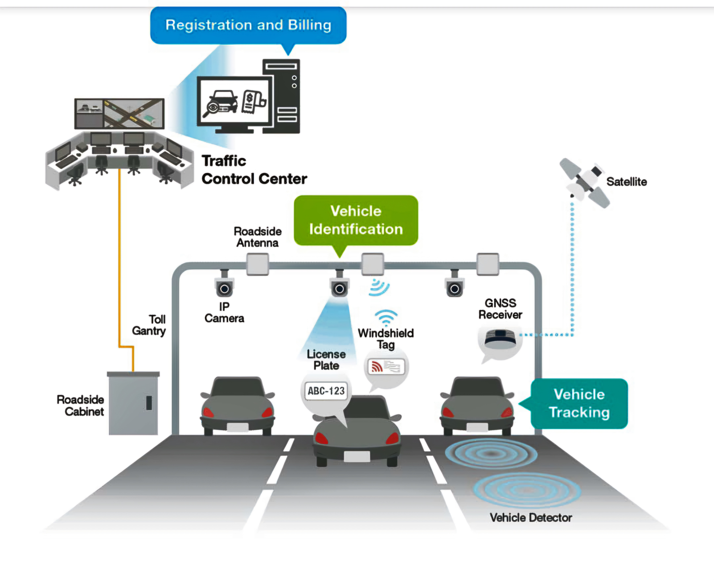
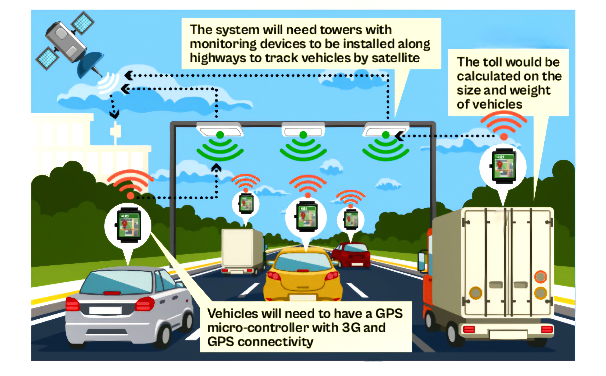
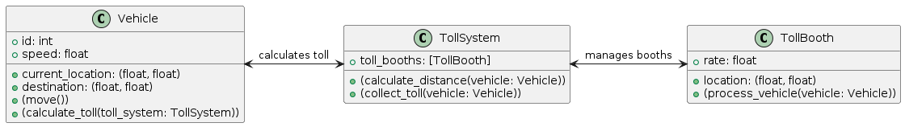
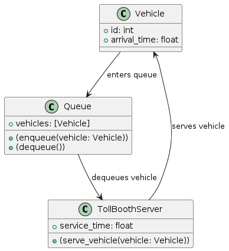
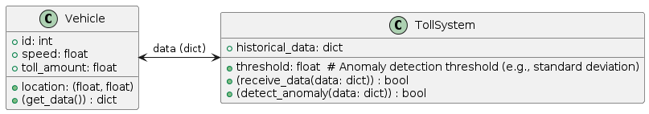
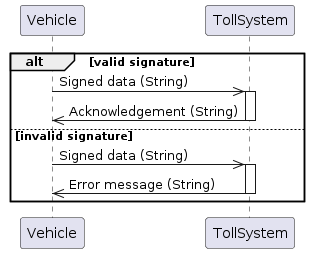
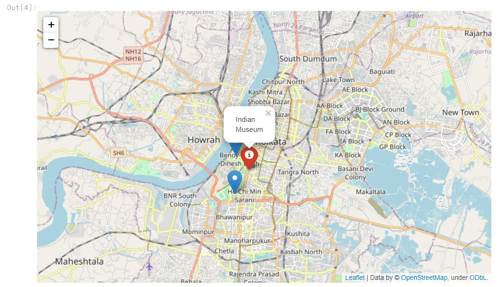

# Simulating the Future: A Python-Powered Glimpse into India's GPS Tolling Revolution

  

  _Forget toll booth delays! Dive into a world of uninterrupted journeys with a simulated GPS-based tolling system built using Python. This program acts as a window into India's transportation future. Imagine ANPR cameras (simulated in Python) along highways capturing license plates, while virtual GPS units track vehicle movement. The program then calculates the distance traveled and deducts tolls electronically based on vehicle class (pre-programmed data). This translates to smoother traffic flow, fairer tolls based on actual distance, and reduced operational costs. By simulating this system with Python, we're not just building a program, we're paving the way for a more efficient, data-driven approach to infrastructure management, ultimately propelling India's economic engine forward._

  

  

## Toll Gates in India:

### _Current_Situation_

**Functionalities**:
  
  
⭐ Collect tolls (varies by vehicle type, distance, etc.)
  
⭐ Manage traffic flow (reduce congestion)
  
⭐ Gather data (traffic patterns, revenue forecasting)
  
⭐ Enhance safety (weighbridges for overloaded vehicles)
  

**Economic Impact (Positive)**:
  
  
⭐ Fund infrastructure (build & maintain roads/bridges)
  
⭐ Improve logistics (reduce transport costs & delays)
  
⭐ Create jobs (toll collectors, maintenance, security)
  
⭐ Boost growth & development (connectivity, tourism, investment)
  

**Limitations (To Address)**:
  
  
⭐ Cost burden (toll fees for businesses & individuals)
  
⭐ Traffic congestion (toll plazas as bottlenecks)
  
⭐ Transparency concerns (fairness of toll collection)
  

#### A GPS-based toll collection system has the potential to significantly improve India's toll gate system by eliminating traditional toll booths. Here's how:

  

  

  

#### Advantages of GPS Tolling:

⭐**Fairness and Transparency**: Drivers are charged based on the exact distance traveled, ensuring a fairer system compared to the fixed rate at toll booths.
 
⭐**Reduced Traffic Congestion**: Eliminates the need to stop at toll booths, leading to smoother traffic flow and faster commutes.
 
⭐**Lower Operational Costs**: No need for manpower to operate toll booths, reducing overall toll collection expenses.
 
⭐**Improved Security**: Automatic number plate recognition (ANPR) with GPS data can help deter toll evasion.
 

#### How it Would Work:

⭐ **On-board Unit (OBU)**: Vehicles would require an OBU with GPS and cellular connectivity.
 
⭐ **Automatic Number Plate Recognition (ANPR)**: Cameras along highways would capture license plates.
 
⭐ **Distance Calculation**: The system tracks the vehicle's entry and exit points, calculating the distance traveled.
 
⭐ **Toll Deduction**: The appropriate toll amount is deducted from the linked account based on distance and toll rates.
 

#### Current Status and Challenges:
<
⭐**Pilot Stage**: The GPS-based system is still under development and pilot testing in India.
 
⭐**OBU Implementation**: Equipping all vehicles with OBUs could be a logistical challenge.
 
⭐**Privacy Concerns**: Data security and privacy concerns regarding vehicle location tracking need to be addressed.
  

## GPS-based toll collection system in India might work:

 
 

  

 
 

#### Onboard Unit (OBU):

👉 Every vehicle would require an OBU installed. This device would likely have:
 
👉 GPS for tracking location
 
👉 Cellular connectivity (3G or later) for data transmission
 
 
#### Monitoring System:

👉 **Towers with ANPR Cameras**: These would be installed along highways at designated points.
 
👉 Automatic Number Plate Recognition **(ANPR)** cameras would capture license plates.
 
👉 **Centralized Processing Unit (CPU)**: This central system would:
 
👉 Receive data from **ANPR cameras** and OBUs.
 
👉 Match license plates with OBU data.
 
👉 **Calculate distance** traveled using entry and exit point data.
 
 

#### Toll Calculation and Deduction:

#### The CPU would consider:

👉 **Distance traveled** (from ANPR data)
 
👉 **Vehicle classification** (pre-registered data linked to license plate)
 
Toll rates for specific road sections and vehicle types.
The appropriate toll amount would be deducted from the linked account associated with the vehicle's OBU.
  

#### Benefits:

👉 **No stopping at toll booths**: Freer flowing traffic and faster commutes.
 
👉 **Fair and transparent**: Tolls based on exact distance traveled.
 
👉 **Reduced costs**: Lower operational expenses for toll collection.
  

#### Challenges:

👉 **OBU implementation**: Equipping all vehicles might be complex.
 
👉 **Privacy concerns**: User data security and privacy need to be addressed.
 
👉 **Network coverage**: Reliable cellular connectivity is crucial throughout the highway network.

 
 

Overall, a GPS-based system has the potential to streamline toll collection in India. However, addressing the challenges is crucial for successful implementation.
A GPS-based toll system offers a promising way to modernize India's toll network. While challenges exist, successfully implementing this system could lead to a more efficient, fair, and convenient toll collection process.

  ## Project Demo

See a video walkthrough of the project here: [Project Demo](assets/demo.mp4)

 
 

**A sustainable GPS toll system simulation in Python, leveraging different models and tools for optimal efficiency and scalability**.

 
 

### 1. System Requirements Definition

**Data Acquisition**:
 
 
⭐ Real-time or historical GPS data (e.g., from government agencies, GPS providers).
 
⭐ Toll rate structure (fixed, variable, distance-based).
 
⭐ Traffic flow statistics (vehicles per hour, vehicle types).
  

**Simulation Parameters**:
 
 
⭐ Geographic scope of the simulated area (city, region, highway).
 
⭐ Timeframe of the simulation (day, week, month).
 
⭐ Frequency of toll calculations (per minute, per kilometer).
 

**Performance Goals**:
 
 
⭐ Real-time or near-real-time simulation capability.
 
⭐ Scalability to handle large volumes of simulated vehicles.
 
⭐ Accuracy of toll calculations based on distance and rate structure.
 

### 2. Model Selection

**Cellular Automata Models**:
 
 
👉 Efficiently simulate traffic flow dynamics and toll booth interactions on a grid-based representation.
 
👉 Vehicle class encapsulates attributes and methods for vehicle movement and toll calculations.
 
👉 TollBooth class defines location and rate information, along with a method to process vehicles.
 
👉 TollSystem class manages toll booths, calculates distances, and collects tolls.
 
 

  
**Agent-Based Models** :
 
 
👉 Well-suited for modeling realistic behaviors of individual vehicles and drivers.
 
👉 Requires creating agent classes (e.g., DriverAgent, VehicleAgent) with decision-making capabilities.
 

**Queueing Models**:
 
 
👉 Analyze queue lengths and waiting times at toll booths to optimize collection methods.
 
👉 Vehicle class stores arrival time for queueing purposes.
 
👉 Queue class manages a list of vehicles and handles enqueueing and dequeueing operations.
 
👉 TollBoothServer class represents a toll booth with a service time and a method to serve vehicles.
 
 

  

 
 

## Scalability and Sustainability
 

⭐ Consider cloud-based computing platforms (e.g., Google Cloud, Amazon Web Services) to handle large datasets and simulations.
 
⭐ Use containerization with Docker to package dependencies and ensure consistent execution across environments.
 
⭐ Implement unit tests for individual code components to ensure reliability during updates and maintenance.
 

## Enhancing Security

**Encrypted Communication**:
 
 
⭐_Problem_⭐: Unencrypted communication channels are vulnerable to eavesdropping. Hackers can intercept data transmissions and steal sensitive information like location data, toll amounts, and user IDs.
 
⭐_Solution_⭐: Implement encryption protocols like TLS (Transport Layer Security) or SSL (Secure Sockets Layer) to encrypt data transmission between the vehicle's GPS module, cloud server, and payment gateway. Encryption scrambles the data, making it unreadable to unauthorized parties.

**Anomaly Detection**:
 
 
⭐_Problem_⭐: Malicious actors might try to manipulate the system by altering location data or bypassing toll booths.
 
⭐_Solution_⭐: Implement anomaly detection algorithms to analyze GPS data for unusual patterns. These algorithms can identify suspicious activities like sudden jumps in location, unrealistic speeds, or frequent exits without toll payments. By flagging such anomalies, the system can trigger alerts for investigation and prevent fraudulent transactions.

**Digital Signatures**:
 
 
⭐_Problem_⭐: Without user verification, unauthorized individuals might attempt to initiate payments using stolen credentials.
 
⭐_Solution_⭐: Implement digital signatures during transactions. Users can use digital certificates or one-time passwords (OTPs) to sign transactions, ensuring only authorized users can initiate payments. This verification process authenticates the user's identity and prevents unauthorized access.

  

## Double-Edged Sword: Tracking's Impact on GPS Tolling
 
 

  While GPS technology promises a revolution in India's toll booth system, the very act of tracking every vehicle raises concerns. A simulated Python model can showcase the efficiency gains – smoother traffic flow, fair distance-based tolls, and reduced costs. However, this tracking can raise privacy issues and potentially be exploited for misuse. To ensure the success of GPS tolling, India must strike a balance between leveraging tracking's benefits and implementing robust data security measures to safeguard user privacy. This way, the system can truly unlock its potential for a more efficient and transparent transportation network.

   

  

