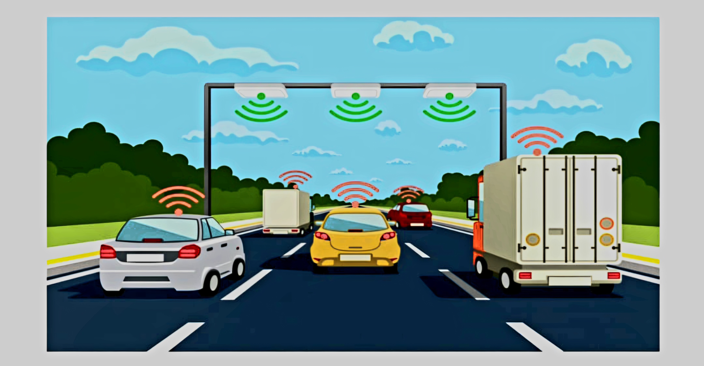

<h4 align="center">
  <I>"Transforming Innovation into Efficiency: A Python-powered GPS Toll Simulation"</I>
</h4>

<p align="middle">This project bridges the gap between creative ideas and real-world impact. By simulating GPS-based toll systems in Python, we gain valuable insights into optimizing traffic flow, reducing congestion, and streamlining toll collection. This simulation will serve as a powerful tool for:</p>

⦿ Testing and evaluating new toll strategies before implementation.
<br>
⦿ Identifying potential bottlenecks in existing toll systems.
<br>
⦿ Designing more efficient and user-friendly toll experiences.
<br>

## GPS Toll Booth Simulation (Python)

<p align="left">This project simulates a basic GPS-based toll booth system using Python. It aims to provide a foundation for exploring and understanding how toll collection might work using real-time location data.</p>

**Functionality**:

⦿ Simulates vehicles traveling on a highway with a toll booth.
<br>
⦿ Vehicles are assigned random speeds and arrival times.
<br>
⦿ When a vehicle reaches the toll booth location, a toll is charged based on its axle count.
<br>
⦿ The simulation tracks total revenue collected and average travel time.

**Benefits**:

⦿ Provides a basic model for exploring GPS-based toll systems.
⦿ Helps visualize potential impacts on traffic flow and revenue collection.
⦿ Serves as a platform for further development and experimentation.

Requirements:

Python 3.x (https://www.python.org/downloads/)

Libraries:

This project utilizes minimal libraries to keep it simple and focused.

Clone or download the project repository.

```
git clone https://github.com/techySPHINX/gps-toll-simulation.git
```

Open a terminal window and navigate to the project directory.
```
cd gps-toll-simulation
```

Run the simulation script using python main.py.
```
python main.py
```

```
"""
GPS Toll Booth Simulation (Python)

This project simulates a basic GPS-based toll booth system...
"""

import random
from datetime import datetime

class Vehicle:
    """
    Represents a vehicle with arrival time, speed, axle count, and travel time.
    """

    def __init__(self, arrival_time, speed, axle_count):
        self.arrival_time = arrival_time
        self.speed = speed
        self.axle_count = axle_count
        self.travel_time = None  # Initially unknown, calculated during simulation

class TollBooth:
    """
    Represents a toll booth with location, total revenue collected, and number of vehicles processed.
    """

    def __init__(self, location):
        self.location = location
        self.total_revenue = 0
        self.vehicles_processed = 0

    def process_vehicle(self, vehicle):
        """
        Processes a vehicle by calculating travel time, toll, and updating statistics.
        """

        travel_time = (self.location - vehicle.arrival_time) / vehicle.speed
        vehicle.travel_time = travel_time

        toll = self.calculate_toll(vehicle.axle_count)
        self.total_revenue += toll
        self.vehicles_processed += 1

    def calculate_toll(self, axle_count):
        """
        Calculates the toll based on the axle count. You can customize the pricing logic here.

        This example uses a simple base toll and additional toll per axle.
        """

        base_toll = 5  # Replace with your desired base toll amount
        additional_toll = 2  # Replace with your desired additional toll per axle
        return base_toll + (axle_count - 1) * additional_toll

def generate_vehicles(num_vehicles):
    """
    Generates a list of vehicles with random arrival times, speeds, and axle counts.
    """

    vehicles = []
    for _ in range(num_vehicles):
        arrival_time = datetime.now() - datetime.timedelta(seconds=random.randint(0, 3600))  # Simulate arrival times within the last hour
        speed = random.randint(40, 80)  # Simulate random speeds within a reasonable range (km/h)
        axle_count = random.randint(2, 6)  # Simulate random axle counts (2-6)
        vehicle = Vehicle(arrival_time, speed, axle_count)
        vehicles.append(vehicle)
    return vehicles

def run_simulation(vehicles, toll_booth):
    """
    Simulates the toll booth operation by processing each vehicle and calculating statistics.
    """

    for vehicle in vehicles:
        toll_booth.process_vehicle(vehicle)

    # Calculate average travel time (assuming all vehicles have been processed)
    average_travel_time = sum(vehicle.travel_time for vehicle in vehicles if vehicle.travel_time is not None) / len(vehicles)

    print("Total Revenue Collected:", toll_booth.total_revenue)
    print("Average Travel Time:", average_travel_time)

if __name__ == "__main__":
    num_vehicles = 20  # Number of vehicles to simulate
    toll_booth = TollBooth(10)  # Simulate toll booth location at 10 km on the highway
    vehicles = generate_vehicles(num_vehicles)
    run_simulation(vehicles, toll_booth)

```

<h4 align="center"><I>This project acts as a springboard for further exploration and experimentation with GPS-based toll systems. </I></h4>
<div align="center">
### 𝚂𝚑𝚘𝚠 𝚜𝚘𝚖𝚎 ❤️ 𝚋𝚢 𝚜𝚝𝚊𝚛𝚛𝚒𝚗𝚐 𝚜𝚘𝚖𝚎 𝚘𝚏 𝚝𝚑𝚎 𝚛𝚎𝚙𝚘𝚜𝚒𝚝𝚘𝚛𝚒𝚎𝚜!
</div>
